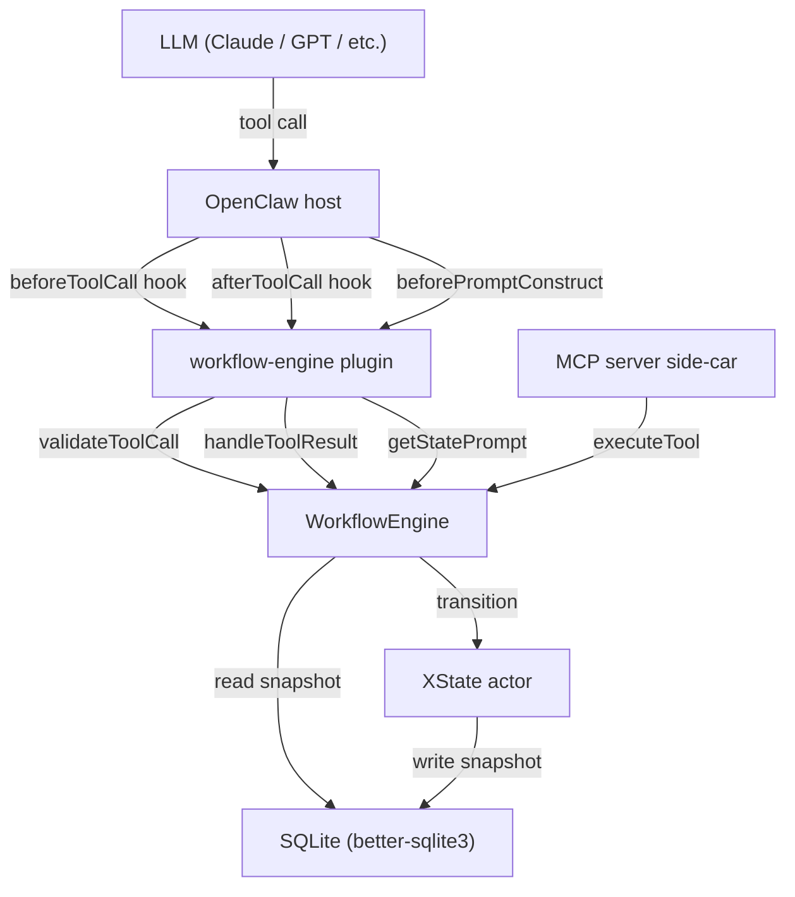

# @openclaw-community/workflow-engine

A state-machine workflow enforcement layer for OpenClaw agents. Prevents LLM drift in multi-step structured workflows by combining deterministic XState-based state transitions, per-state tool scoping, Zod input/output validation, idempotency enforcement, and a fully queryable SQLite audit log — all in a single installable package. The LLM *cannot* skip steps, call tools out of order, or re-execute idempotent operations, regardless of how it reasons about the conversation.

---

## Installation

```bash
openclaw plugins install @openclaw-community/workflow-engine
```

Or as a standalone MCP server / Node.js library:

```bash
npm install @openclaw-community/workflow-engine
```

---

## Quick start

### 1. Create a workflow definition

```typescript
// .openclaw/workflows/order-fulfillment.ts
import { createMachine } from 'xstate'
import { z } from 'zod'
import type { WorkflowDefinition } from '@openclaw-community/workflow-engine'

const workflow: WorkflowDefinition = {
  id: 'order-fulfillment',
  machine: createMachine({
    initial: 'draft',
    states: {
      draft:       { on: { SUBMIT:  'review'      } },
      review:      { on: { APPROVE: 'fulfillment',
                           REJECT:  'draft'       } },
      fulfillment: { on: { SHIP:    'shipped',
                           CANCEL:  'cancelled'   } },
      shipped:     { type: 'final' },
      cancelled:   { type: 'final' },
    },
  }),
  toolsByState: {
    draft: [{
      name: 'submit_order',
      description: 'Submit the order for review',
      inputSchema: z.object({ orderId: z.string() }),
      onSuccess: 'SUBMIT',
    }],
    review: [
      {
        name: 'approve_order',
        description: 'Approve the order',
        inputSchema: z.object({ orderId: z.string(), notes: z.string().optional() }),
        onSuccess: 'APPROVE',
      },
      {
        name: 'reject_order',
        description: 'Reject and return for revision',
        inputSchema: z.object({ reason: z.string() }),
        onSuccess: 'REJECT',
      },
    ],
    fulfillment: [{
      name: 'ship_order',
      description: 'Mark as shipped',
      inputSchema: z.object({ trackingNumber: z.string() }),
      onSuccess: 'SHIP',
    }],
  },
  promptsByState: {
    draft:       'Prepare the order. When all required fields are present, call submit_order.',
    review:      'Review the order carefully. Call approve_order or reject_order.',
    fulfillment: 'Obtain a tracking number then call ship_order.',
  },
}

export default workflow
```

### 2. Configure the plugin

```json
// openclaw.json (excerpt)
{
  "plugins": {
    "workflow-engine": {
      "workflowsDir": ".openclaw/workflows",
      "dbPath": ".openclaw/workflow.db",
      "enableDashboard": true,
      "dashboardPort": 3847
    }
  }
}
```

### 3. Compile definitions and restart

```bash
tsc   # compile .ts → .js inside workflowsDir
openclaw restart
```

The plugin automatically loads compiled `.js` files from `workflowsDir` at startup.

---

## MCP server (standalone)

```bash
# stdio — works with Claude Code, Cursor, and any MCP client
npx workflow-engine serve --workflows ./workflows --db ./workflow.db

# SSE — for browser-accessible MCP clients
npx workflow-engine serve --transport sse --port 3847 \
  --workflows ./workflows --db ./workflow.db
```

---

## API reference — `WorkflowDefinition`

```typescript
interface WorkflowDefinition {
  /** Unique identifier used to start and reference instances */
  id: string

  /** XState v5 state machine — defines all states and transitions */
  machine: AnyStateMachine

  /**
   * Tools available per state.
   * Key = XState state name; value = array of ToolDefinition.
   * Only the tools listed here for the current state are ever visible to the
   * LLM — all others are removed from tools/list automatically.
   */
  toolsByState: Record<string, ToolDefinition[]>

  /**
   * Optional system-prompt fragment injected per state via beforePromptConstruct.
   * Sending only the relevant fragment (not the full workflow context) reduces
   * token cost and LLM confusion (StateFlow pattern — arXiv 2403.11322).
   */
  promptsByState?: Record<string, string>

  /**
   * Per-state Zod validators.
   * - Keyed by XState event name → transition-payload validator
   * - Keyed by tool name       → output validator
   */
  validationsByState?: Record<string, Record<string, ZodSchema>>
}

interface ToolDefinition {
  name: string
  description: string
  inputSchema: ZodSchema

  /** XState event to fire on successful execution (advances the state machine) */
  onSuccess?: string

  /** If true, engine auto-calls readTool immediately after the write succeeds */
  requiresReadAfterWrite?: boolean
  /** Which tool to call for the automatic post-write read */
  readTool?: string

  /**
   * Template for idempotency key, e.g. '{session_id}_{set_number}'.
   * Duplicate calls with the same resolved key return the cached result instead
   * of re-executing the tool.
   */
  idempotencyKeyTemplate?: string
}
```

---

## Example — Workout coach workflow

See [examples/workout-coach.ts](examples/workout-coach.ts) for a complete real-world example with all state transitions, tool definitions, idempotency keys, read-after-write, and prompt fragments.

---

## Architecture



---

## How enforcement works — the four layers

| Layer | Mechanism | What it prevents |
|-------|-----------|-----------------|
| **1. Prompt** | `beforePromptConstruct` injects state-specific instructions | LLM confusion about available actions |
| **2. Tool list** | `tools/list` only exposes tools for the current state | LLM hallucinating unavailable tools |
| **3. Validation** | `beforeToolCall` rejects forbidden tools + invalid inputs | Bypassing scoping via direct API calls |
| **4. Audit** | Every attempt (valid or rejected) logged to SQLite | Post-hoc detection and forensic replay |

Following the "assume failure at every layer" principle, no single layer is treated as sufficient — all four operate in concert.

---

## Configuration options

| Key | Type | Default | Description |
|-----|------|---------|-------------|
| `workflowsDir` | `string` | `.openclaw/workflows` | Directory scanned for compiled `.js` workflow files |
| `dbPath` | `string` | `.openclaw/workflow.db` | SQLite database path |
| `enableDashboard` | `boolean` | `false` | Start the HTTP dashboard |
| `dashboardPort` | `number` | `3847` | Dashboard TCP port |

---

## Audit log schema

```sql
CREATE TABLE workflow_audit_log (
  id          INTEGER PRIMARY KEY AUTOINCREMENT,
  instance_id TEXT,
  event_type  TEXT NOT NULL,   -- see event types below
  tool_name   TEXT,
  payload     TEXT,            -- JSON
  created_at  TEXT NOT NULL DEFAULT (datetime('now'))
);
```

| `event_type` | When emitted |
|---|---|
| `instance_created` | `startWorkflow()` called |
| `tool_called` | Tool execution begins |
| `tool_succeeded` | Tool returned successfully |
| `tool_rejected` | Tool not valid in current state |
| `validation_failed` | Zod schema rejected input |
| `idempotency_hit` | Duplicate key — cached result returned |
| `state_changed` | XState transition fired |
| `instance_completed` | Final state reached |
| `instance_reset` | `resetWorkflow()` called |
| `transition_failed` | XState transition rejected |
| `read_after_write_failed` | Automatic post-write read errored |

---

## Testing on OpenClaw

Manual verification checklist (run against a real OpenClaw 2026.4.x instance after `openclaw plugins install`):

```
□ Plugin appears in `openclaw plugins list`
□ workflow_list tool is visible in the tool panel
□ Starting a workflow shows the state-specific prompt in the system prompt view
□ Calling a tool from a wrong state is blocked with a clear error message
□ After a valid tool call, workflow_status shows the next state
□ Duplicate tool call with idempotency key returns cached result, not re-executed
□ Kill and restart OpenClaw mid-workflow — instance resumes from saved state
□ enableDashboard: true — dashboard renders at http://localhost:3847
□ MCP side-car responds to tools/list (stdio or SSE transport)
```
